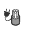

# Creating Connectors

- First create or import all necessary connector models into your
  document

- Using the Wire Connector tool
  {width="0.5780938320209974in"
  height="0.6166305774278216in"}define your part by

  - Selecting the connector in the connector parts field

  - Defining the insertion point (Where the connector will connect)

    - Make sure your MATE connector is oriented so that the blue is up
      and red is towards the connection

{width="4.044010279965004in"
height="2.053280839895013in"}

- Decide whether connector, terminal, or splice

  - A connector takes multiple wires, a terminal takes one, and a splice
    is a single connection wire joint -- You will likely be using
    connectors for things like ethernet cables, and terminals for
    bullet, spade, or fork connectors.

- Select the pinout of your part

{width="2.692195975503062in"
height="1.796438101487314in"}

- This will create a green line and a magenta line. This is useful for
  calculating the wire length in the final product

  - The magenta line is the strip length of your wire

  - The green line is the insulation length -- This is how long your
    wire comes out before it begins being routed

  - The two can be offset by dragging the circle. This is useful for my
    example because the wire will be stripped within the middle of the
    connector before being crimped down

> {width="6.5in"
> height="1.7625in"}

- Set the name of your connector

- Notice it makes a composite part

- If you were making a connector instead of a terminal, you will notice
  a section called designators

  - Label each designator based on the necessary connection

> {width="5.062938538932634in"
> height="3.7294903762029747in"}

# Creating a clip

- Create the model of your clip

- Select the clip tool
  {width="0.360582895888014in"
  height="0.33804680664916886in"}

- Select the axis that the wires will travel through the clip through

- Select the Mate connector to mount the clip

- You can select 'use part center' and this will bring the wire to move
  through the center of the clip

{width="4.071186570428696in"
height="2.8627482502187225in"}
