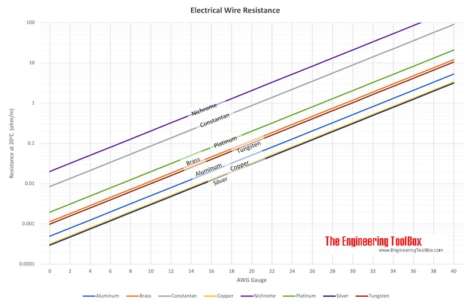

Electronics onboard an ROV is one of the most important steps in the
build process. A well organized electrical system in your ROV is key in
making it reliable, easy to fix in case of failure, and significantly
safer.

# Introduction to Electricity:

Electricity can be very confusing and its very important to have a basic
understanding of the different terms before working. A common analogy
for electricity is to think of it as water flowing through a pipe.

- Voltage (V): This is the water pressure in the pipe. It is the
  electrical potential between different electrical components. A higher
  voltage means there is more push through the circuit. A higher voltage
  can mean faster spinning motors, brighter lights, generally more power
  in the circuit. With too low a voltage, electrical components may not
  turn on and with too high a voltage, electrical components may break.

- Current (A, or I): Current is measured in Amperes or amps. This is
  essentially the flow rate of the water. It represents the electrical
  charge flowing through a wire per second. In general, every component
  has a certain amount of current it needs to operate at its highest
  performance. A higher current can mean faster spinning motors. In
  general components are safe regardless of the amount of current able
  to be given to them, although some components such as lights may need
  their current to be limited

- Resistance (Ω): Resistance is measured in ohms. This is like an
  obstruction in the flow. It opposes the current. Every component has
  some internal resistance, limiting the number of components.

- Power (W): Measured in watts, it is equal to the voltage times the
  current. If a battery has a potential of 12 volts, and is capable of
  providing 10 amps of current, it is able to provide 120W of power.

- Energy (J): Measured in joules it is equal to the watts used for a
  certain amount of time. One Joule is equal to one watt second.

- Circuit: For electricity to flow, it needs to have a complete closed
  loop called a circuit. The electricity in a circuit will flow from the
  positive side of a battery to the negative side. If a circuit isn't
  fully connected it will cause the flow to stop. A great basic circuit
  simulator is the tinkercad circuit simulator:
  <https://www.tinkercad.com/circuits>

- Parallel Wiring: Components that are wired in parallel split the
  current between the two components. Considering the water analogy,
  this would look like a pipe that splits into multiple pipes. Current
  is divided among components. Within a circuit it may look like the
  following:

> {width="3.271116579177603in"
> height="2.854413823272091in"}

- Wiring in Series: The current runs through one component into another
  component. There is only one way for the current to flow. Voltage is
  divided or shared among components. It may look like the following:

{width="3.2086111111111113in"
height="2.479381014873141in"}

- Ohm's Law: Ohm's Law is one of the most important relations in
  electrical engineering. It states that $V = IR$ or the voltage is
  directly proportional to the current multiplied by the resistance.
  With a higher current, or a higher resistance the resulting voltage
  will be higher.

# Introduction to Wires:

- Wire Gauge (AWG): The American Wire Gauge (AWG) system is a standard
  for wire thickness. In this system, the lower the AWG, the thicker the
  wire is. Lower AWG wires are capable of carrying more current safely
  than a higher AWG.

  - It is also worth mentioning that while a wire might be able to
    safely handle a current, it may not operate as efficiently. For
    example, an 18AWG wire might be able to handle 10 amps, it is losing
    1.2W of power per foot. Compare this to a 12AWG wire that is instead
    losing .3W of energy per foot. As the current gets closer to the
    maximum amount it is able to handle, the wire act as a resistor
    losing energy in the pure form of heat.

- Stranded vs Solid Core Wire: A stranded wire is made of many small
  threads of copper. A solid core wire is make of a single thick copper
  conductor. A stranded wire is much more flexible and resistant to
  breaking than a solid core wire.

- Insulation: The plastic coating on a wire is crucial for preventing
  exposed wire touching something. It is incredibly important that the
  insulation is not nicked or damaged

# SAFETY FIRST!

## What is short circuiting?

A short circuit is one of the most common and most dangerous electrical
failures for an electrical system. A short circuit happens when an
accidental path is created with low resistance that bypasses components.
Thinking back to the water analogy, it would be like a pipe breaking
near the source causing water to gush out uncontrolled. This could
realistically happen in an electrical system if a positive wire attached
to the battery were to touch a wire attached to the negative side. In
this event, all of the available current would stop flowing to
components and instead flow directly out of the battery through the
wires and then back into the battery. This is dangerous because this
unrestricted flow can generate enough heat to melt wires effectively
welding them together making them more difficult to separate.

## Battery Safety:

Lithium Polymer or LiPo batteries capable of delivering lots of energy
very quickly.

- Never let batteries short circuit. LiPo batteries specifically can
  catch on fire if delivering unrestricted current.

- Always disconnect your battery before working on electronics.
  Attaching electronics while powered can cause sparks.

- Never puncture or damage a battery pack -- If puncture or damaged do
  not use

- Use a proper LiPo charger with a LiPo battery

- A common sign of damage in a LiPo battery is inflation. Do not charge
  or use an inflated battery!

- LiPo batteries has a specific range of voltage they are meant to be
  used within. Discharging a LiPo battery below its minimum safe usage
  can degrade the battery significantly and even be dangerous.

## Soldering Safety:

- Soldering can produce fumes. Solder in a well ventilated area
  especially when using lead based solder.

- A hot soldering iron can cause serious burns. Never touch the top of
  the iron, and always return the iron to its stand after use. Always
  unplug the soldering iron when finished.

## Polarity of Electrical Components:

Most electrical components have a positive and negative. The positive
side of a battery must be wired to the positive side of your component.
If the positive is wired to the negative side, this can destroy your
electronics.

# Wiring Your ROV

For an ROV to work properly, the power must be properly distributed to
each individual component.

## High Power System (14.8V distribution from battery)

The battery will need to connect to each component in parallel. The
easiest way to distribute this power is with terminal blocks. Here, you
wire the positive output of the battery into one and then the negative
into another. Each individual component is connected allowing to the
positive and negative terminals for parallel power distribution. Be
careful of polarity when wiring components to terminal blocks!

## Low Power System (5V distribution)

Run the output of the 5V converter into new terminal blocks. Currently,
the only uses for the 5V supply are the flight controller, and the
raspberry pi. Adding a manipulator, or other sensors may require a 5V
supply so if you plan to do this using a larger terminal block could be
useful.

## Other Connections

- Each ESC has a 3 wire output into the motors. Wire each of these
  output from the ESC to the three wire cable. The 3 wire cable goes
  through the penetrator, and attaches to the motor on the other side.

- ESCs also have a smaller white and black wire. This is the signal and
  ground wire to communicate with the flight controller.

- The Raspberry Pi camera has a ribbon connector that gets pushed into
  the input for the camera ribbon connector on the Raspberry Pi. After
  pushing it in, push the surrounding plastic down to lock it in place.

# Advanced Electrical Concepts

## Voltage Drop

Over long wires, when a high amount of current is passed through them
the voltage can "drop" meaning it becomes lower than desired. All wires
have some sort of resistance, and it is significantly more through a
longer wire. Voltage drop is a direct application of Ohm's Law. If you
run a higher current through a lower gauge wire, the output voltage will
decrease because of the resistance.

Think of the following example. If your ROV uses 50 amps at maximum
thrust, requires a minimum of 12 volts to run properly a maximum of 20
volts, and you require 100 feet of tether, you must find the proper
supplied voltage and the correct gauge of wire for the resistance for
the voltage minimum to be within the dropped voltage amount.

There are a lot of specifics for voltage drop including temperature,
type of wire, stranded vs solid core, and others. The most important
through is material. You can get a pretty good estimate of resistance
per meter of wire by looking at this chart:

{width="6.5in"
height="4.225in"}

### Steps for finding proper cable AWG:

1.  Finding Maximum Allowed Voltage Drop

The ROV needs at least 12V to run. It cannot have above 12 volts. To
find the maximum allowed voltage drop you can use the following formula:

$$V_{drop\ max} = V_{supply} - V_{minimum}$$

Therefore:

$20V - 12V = 8V$ Maximum

2.  Finding Maximum Allowed Resistance

Using Ohm's Law you can find the maximum resistance the tether can have:

$$V_{drop} = IR$$

Rearranging:

$$R = \frac{V_{drop}}{I}$$

Therefore:

$$R = \frac{8V}{50A} = .16\Omega$$

3.  Finding Maximum Resistance per Meter

A circuit required a two wires (a positive and a negative), so the
current must travel twice the length of the tether. When using wire
length this means the voltage is dropping because of resistance getting
there and coming back.

Finding total wire length:

$$L_{total} = 2*L_{tether}$$

$$L_{tether} = 2*100ft = 200ft$$

Converting to meters:

$1\ m = \ 3.28ft$ $\frac{200ft}{3.28\frac{ft}{m}} = 60.98m$

Finding total resistance per meter:

$$\frac{.16\Omega}{60.98m} = .00262\frac{\Omega}{m}$$

4.  Finding current AWG based on chart:

$$.00262\frac{\Omega}{m}$$

Therefore, when using copper wire at minimum, a 9 AWG wire must be used

## Power and Energy

In relation to an automobile, power is the car's horsepower -- it is
what determines how fast a car accelerates or drives. The energy is
similar to the car's fuel tank. It is the total amount of fuel a car can
store. When driving more aggressively (using more power), you use more
fuel faster.

### Power

Power is the rate at which electricity is used. It is an instantaneous
measurement of how much work something is doing at that very moment.

$$Power\ (P) = Voltage\ (V)*Current\ (I)$$

If the motor of an ROV is running on 16 volts, and uses 22 amps, the
power could be calculated to be:

$$Power = 16*22 = 352W$$

### Energy

Energy is the total amount of power used over a period of time.

$$Energy\ (E) = \ Power\ (P)*Time\ (t)$$

Energy can be measured in many different units. Common measurements are
Joules which is equivalent to one watt second, as well as the unit watt
hours which is self-explanatory.

In order to find the Energy required to run the thruster previously
mentioned for 30 minutes the amount of watt hours used can be found:

$$Energy\ (Wh) = 352\ W*\ .5\ h = \ 176Wh$$

### Finding necessary battery size:

An education group would like to let students test out a commercial ROV
that runs on around 16V. The onboard electronics use around 1A
regardless of motor use. Each motor at its highest thrust uses around 18
amps. If an ROV is in a vectored configuration at full throttle going
forwards it will have four motors at full thrust. Assuming students want
to see the ROV move fast and therefore only use it at full throttle what
size must a battery be to accommodate a student group using the ROV for
2 hours?

1.  Finding current draw:

$$I = 1A + 4*18A = 73A$$

2.  Finding power:

$$P = I*V$$

$$P = 73A*16V = 1168W$$

3.  Finding energy use:

$$E = P*t$$

$$E = 1168*2h = 2336Wh$$

## Electromagnetic Interference

When a high amount of current is ran through a wire, it creates a small
magnetic field around it. This can be incredibly beneficial -- motors
use this electromagnetic field to pull magnets around in a circle. This
can also cause unintended effects though. Just like pulling a magnet, it
can interfere with currents running through other cables. While this
might not be important for other power wires, cables transferring data
such as ethernet or analog video cables can have their sensitive data
interfered with. This effect is most pronounced when close to high
current components with alternating current rather than direct current.

Because of this, running an ethernet cable or video cable, or sensitive
electronic directly next to a high alternating current component is not
recommended as it may not function correctly.
